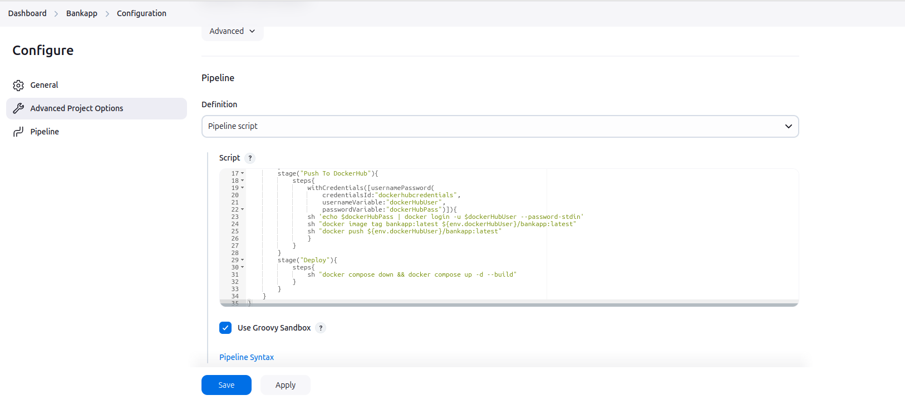

# 🚀 Bank Application Project 
The bank application project involves setting up jenkins pipeline on AWS EC2 using docker.
This pipeline is used to build,test and deploy bank application.

---
 
---
**Project Features**
-------------------

* Jenkins pipeline for building, testing, and deploying a software project
* EC2 instance as a master node and EC2 instance as a worker node
* Dockerfile for building the project image
* Jenkinsfile for configuring the Jenkins pipeline

* AWS account with EC2 instances (Ubuntu 20.04 or later)
* Docker installed on the EC2 instances
* Basic knowledge of Docker, Jenkins, and AWS
 
    
 
  

---

+## 🛠 Prerequisites
+
+Ensure you have the following:
+* **AWS Account** with EC2 instances (Ubuntu 20.04 or later)
+* **Ubuntu EC2 Instance** (Recommended: `t2.medium`)
+* **Docker** installed on the EC2 instances
+* **Basic knowledge** of Docker, Jenkins, and AWS
Ensure you have the following:  
 
  - Docker 
## 🏗 Deployment Steps  

### **<p id="docker-networking">Deployment Using EC2 Instance</p>**  

#### Step 1: Set up the Master Node (EC2 Instance)
**Go to AWS your master-node instances and select security groups and go to add rule `8080` save this.**
**Configure EC2 Security Group:**
+1. Navigate to your EC2 instance's security group
+2. Add inbound rule:
+   - Port: 8080
+   - Protocol: TCP
+   - Source: Custom (Recommended: Your IP) or 0.0.0.0/0 (Not recommended for production)
+3. Save the changes
```bash
ssh -i "your pem- key" ubuntu@ec2-44-244-168-242.us-west
```
Install [Docker](https://docs.docker.com/engine/install/ubuntu/), [java](https://www.jenkins.io/doc/book/installing/linux/), [Jenkins](https://www.jenkins.io/doc/book/installing/linux/)
```bash
sudo apt update -y
```
```bash  
sudo apt install docker.io -y
sudo apt install docker-compose-v2
```
```bash
sudo apt update
sudo apt install fontconfig openjdk-17-jre
java -version
```
```bash
sudo wget -O /usr/share/keyrings/jenkins-keyring.asc \
  https://pkg.jenkins.io/debian-stable/jenkins.io-2023.key
echo "deb [signed-by=/usr/share/keyrings/jenkins-keyring.asc]" \
  https://pkg.jenkins.io/debian-stable binary/ | sudo tee \
  /etc/apt/sources.list.d/jenkins.list > /dev/null
sudo apt-get update
sudo apt-get install jenkins
```
```bash  
sudo usermod -aG docker $USER && newgrp docker
```
```bash
sudo usermod -aG jenkins docker
```
Access <Your_Instance_Public_IP>:8080
  * To Access your jenkins server.


🎉 Congratulations! Your Jenkins Server is live.

#### Step 2: Set up the Worker Node (EC2 Instance)
**Go to AWS your master-node instaces and select security groups and go to add rule `8080` save this.**
```bash
ssh -i "your pem- key" ubuntu@ec2-44-244-168-242.us-west
```
Install [Docker](https://docs.docker.com/engine/install/ubuntu/), [java](https://www.jenkins.io/doc/book/installing/linux/)
```bash
sudo apt update -y
```
```bash  
sudo apt install docker.io && docker-compose-v2 -y
```
```bash
sudo apt update
sudo apt install fontconfig openjdk-17-jre
java -version
```
 
Step 1: Go to the AWS EC2 instance and copy your worker-node public ip address and paste it in the jenkins Agent config windows. 
Craete a Directory in your `workernode.`
```bash
mkdir workernode
```
Copy the Present Working Directory and paste it in the Agent config window.
``bash
pwd
```
Step 2: 

Step 3: Configure your pipeline.

```groovy
pipeline{
    agent { label 'workernode' }
    
    stages{
        stage("Code Clone"){
            steps{
                echo "Code Clone Stage"
                git url: "https://github.com/sushmithavs/Springboot-BankApp.git", branch: "DevOps"
            }
        }
        stage("Code Build & Test"){
            steps{
                echo "Code Build Stage"
                sh "docker build -t bankapp ."
            }
        }
        stage("Push To DockerHub"){
            steps{
                withCredentials([usernamePassword(
                    credentialsId:"dockerhub-creds",
                    usernameVariable:"dockerHubUser", 
                    passwordVariable:"dockerHubPass")]){
                sh 'echo $dockerHubPass | docker login -u $dockerHubUser --password-stdin'
                sh "docker image tag bankapp:latest ${env.dockerHubUser}/bankapp:latest"
                sh "docker push ${env.dockerHubUser}/bankapp:latest"
                }
            }
        }
        stage("Deploy"){
            steps{
                sh "docker compose down && docker compose up -d --build"
            }
        }
    }
}
```

Step 4: Navigate to bank app dashboard and click on `Build Now` button.

Step 5: Your Pipeline has been created


🎉 Congratulations! Your bankapp is running on workernode port `8080.`

👨‍💻 Author: Sushmitha
